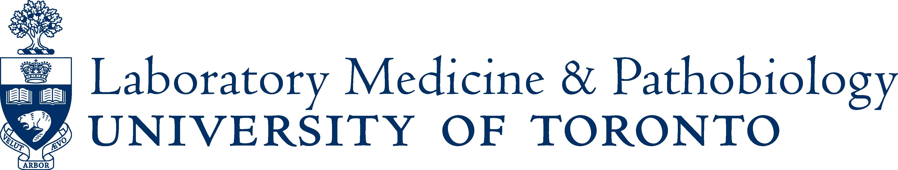

# LMP1210 Winter 2024 
## Basic Principles of Machine Learning in Biomedical Research

**Course syllabus and policies:**  [Course handout](files/pdfs/syllabus.pdf).

**Teaching staff:**  

* Instructors: 
  * [Rahul G. Krishnan](https://www.cs.toronto.edu/~rahulgk/index.html) and [Sana Tonekaboni](https://www.cs.toronto.edu/~stonekaboni/)

Please do not send the instructor or the TAs email about the class directly to their personal accounts.

**Piazza:** Students are encouraged to sign up [Piazza](https://piazza.com/utoronto.ca/winter2024/lmp1210h) to join course discussions.
If your question is about the course material and doesn't give away any hints for the homework, please post to Piazza so that the entire class can benefit from the answer.

**Lecture and tutorial hours:**  

|           | Time      | Location  |
|-----------|--------------|--------------|
| Lecture | Thursday 10:30-12:30 PM  | Sydney Smith building, Room 1079  | 
| Office hours | TBD  | TBD  | 

 
 

---

## Announcements

 - **Jan 9**: Winter term starts! First class session! 
 - **Jan 11**: First LMP1210 class session! 
 - **Jan 18**: Assignment 1 Released, Due February 01!
 - **Feb 1**: Assignment 2 Released, Due February 15!
 - **Mar 7**: Assignment 3 Released, Due March 21!

 
 

---

## Course Overview

This course is intended for graduate students in Health Sciences to learn the basic principles of machine learning in biomedical research and to build and strengthen their computational skills of medical research. The course aims to equip students with the fundamental knowledge of machine learning (ML). During the course, the students will acquire basic computational skills and hands-on experience to deploy ML algorithms using python. The students will learn the current practices and applications of ML in medicine, and understand what ML can and cannot do for medicine. The goal of this course to establish an essential foundation for graduate students to take the first steps in computational research in medicine.

Introduction to basic principles and current practices of machine learning in biomedical research. Focus on the fundamental ML algorithms with applications in biomedical data; the application of unsupervised learning in genomic data; the application of supervised learning for medical images.

 
 

---

## Assignments

|           | Handout                | Due
|-----------|------------------------|---------
| **Assignment #1**   |  [Homework1](files/assignments/hw1.pdf), [data](files/assignments/hw1_data.csv)  | February 2 2023
| **Assignment #2**   |  [Homework2](files/assignments/hw2.pdf), [data](files/assignments/hw2_data.csv)  | February 16 2023
| **Assignment #3**   |  [Homework3](files/assignments/hw3.pdf), [data (zip)](files/assignments/A3_data.zip)  | March 23 2023
| **Final Project**   |  [Handout](files/assignments/project_handout.pdf)  | February 20 2023 (Proposal)

  
Lateness: Assignments and Projects will be accepted up to 3 days late, but 10% will be deducted for each day late, rounded up to the nearest day. After that, submissions will not be accepted and will receive a score of 0.
  

---

## Calendar

Suggested readings included help you understand the course material. They are not required, i.e. you are only responsible for the material covered in lecture. Most of the suggested reading listed are more advanced than the corresponding lecture, and are of interest if you want to know where our knowledge comes from or follow current frontiers of research. Please refer to the [Resources](#Resources) section for the texts.

B = Pattern Recognition and Machine Learning (by Bishop)

DL = Deep Learning Book

MK = Information Theory, Inference, and Learning Algorithms (by MacKay)

RG = Roger Grosse's Notes

|       | Date&nbsp;&nbsp;&nbsp;&nbsp;    | Lecture Topic                  | Slides  | Suggested Readings | Deliverables
|-------|----|------------------------|---------|------------------------------------------|-----------------
| **Lecture&nbsp;1** | Jan 11 | Intro to ML in medicine, nearest neighbor classifier | Slides | B: 1-2 (emphasis on 2.5.2); DL: 2-5   |
| **Lecture&nbsp;2** | Jan 18 | Linear methods for regression and classification; tree-based classifier | Slides|  B: 3-4; RG: [Linear Regression](https://csc413-uoft.github.io/2021/assets/readings/L01a.pdf), [Linear Classifiers](https://csc413-uoft.github.io/2021/assets/readings/L01b.pdf), [Training a Classifier](https://csc413-uoft.github.io/2021/assets/readings/L01c.pdf), MK: p. 22-36 | 
| **Lecture&nbsp;3** | Jan 25 | Introduction to Python; basic linear algebra; evaluation methods |  [Colab](https://colab.research.google.com/drive/1GjFs_E9k-zbAXpOOUMScaDNJbIXCbpvU?usp=sharing) | DL: 2, [David Liu's CSC110/111 Course Notes](https://www.teach.cs.toronto.edu/~csc110y/fall/notes/)  |
| **Lecture&nbsp;4** | Feb 01  | ENSEMBLE-based methods; neural networks  | Slides |  DL: 6-8; RG: [Multilayer Perceptrons](https://csc413-uoft.github.io/2021/assets/readings/L02a.pdf), [Backpropagation (quite technical)](https://csc413-uoft.github.io/2021/assets/readings/L02b.pdf)  | Assignment #1 Due
| **Lecture&nbsp;5** | Feb 08  | Supervised learning; Python tutorial for supervised learning practice  |  Slides, [Colab](https://colab.research.google.com/drive/1cjYq1XL7qLrWa3qnSkFfdvV01Vxoxr0G?usp=sharing)  |   |
| **Lecture&nbsp;6** | Feb 15  | Unsupervised learning for clustering: K-means, Gaussian mixture models | Slides  | B: 9; RG: [Mixture Models](https://www.cs.toronto.edu/~rgrosse/courses/csc311_f21/readings/Mixture%20Modeling.pdf)  | Assignment #2 Due
| **Reading Week** | Feb 22  |   |  |   |
| **Lecture&nbsp;7** | Feb 29   | Unsupervised learning for clustering: auto-encoder, graph-based methods; Python tutorial for unsupervised learning practice  | Slides, [Colab](https://colab.research.google.com/drive/1T-zM9rwGRZDn-xjtp20aactSraBIIP4w?usp=sharing) |  [Jaan Altosaar's VAE Tutorial](https://jaan.io/what-is-variational-autoencoder-vae-tutorial/); [Introduction to VAEs (Kingma and Welling)](https://arxiv.org/abs/1906.02691)  |
| **Lecture&nbsp;8** | Mar 07   | Guest Lecturer: TBD |  |   |
| **Lecture&nbsp;9** | Mar 14  | Guest Lecturer: TBD |  |   |
| **Lecture&nbsp;10** | Mar 21  | Advanced deep learning methods for medical image analysis | Slides |  | Assignment #3 Due
| **Lecture&nbsp;11** | Mar 28  | Term project presentation |   |   |
| **Lecture&nbsp;12** | Apr 04   | Term project presentation |   |   |

 
 

---

## Resources

| Type | Name | Description 
|-----------|------------------------|---------
|Related Textbooks| [Deep Learning (Goodfellow at al., 2016)](https://www.deeplearningbook.org/) | The Deep Learning textbook is a resource intended to help students and practitioners enter the field of machine learning in general and deep learning.
|| [Pattern Recognition and Machine Learning (Bishop, 2006)](http://users.isr.ist.utl.pt/~wurmd/Livros/school/Bishop%20-%20Pattern%20Recognition%20And%20Machine%20Learning%20-%20Springer%20%202006.pdf) | Classic introductory text on machine learning, less emphasis on deep learning approaches.
|| [Information Theory, Inference, and Learning Algorithms (MacKay, 2003)](http://www.inference.org.uk/mackay/itprnn/book.html) | A good introduction textbook that combines information theory and machine learning.
|General Framework| [PyTorch](http://pytorch.org/) | An open source deep learning platform that provides a seamless path from research prototyping to production deployment.
|Computation Platform| [Colab](https://colab.research.google.com) | Colaboratory is a free Jupyter notebook environment that requires no setup and runs entirely in the cloud.
|| [GCE](https://cloud.google.com/compute/) | Google Compute Engine delivers virtual machines running in Google's innovative data centers and worldwide fiber network.
|| [AWS-EC2](https://aws.amazon.com/ec2/) | Amazon Elastic Compute Cloud (EC2) forms a central part of Amazon.com's cloud-computing platform, Amazon Web Services (AWS), by allowing users to rent virtual computers on which to run their own computer applications.

